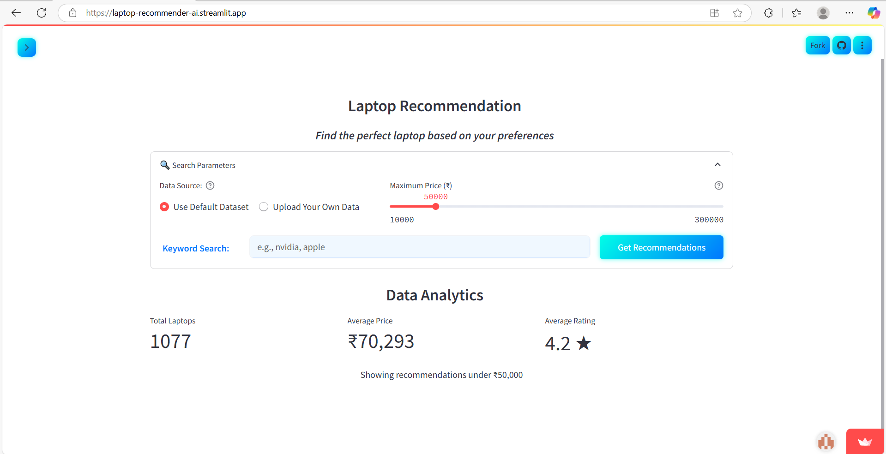
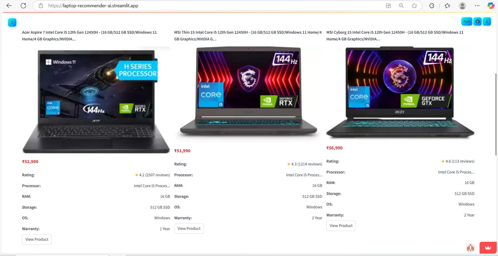

# Laptop Recommendation System

*A machine learning-powered tool to identify the best laptops within your specified budget.*

**Live Demo:** [Streamlit App](https://laptop-recommender-ai.streamlit.app/)  
**GitHub Repository:** [LaptopsRecommendApp](https://github.com/ShaunRod68/LaptopsRecommendApp.git)




---

## Overview

This application assists users in discovering laptops that align with their budget and specific requirements. By leveraging machine learning techniques, it provides tailored recommendations based on user inputs and preferences.

---

## Features

1. **Budget Filtering:** Users can input their maximum budget, and the system filters available laptops accordingly.
2. **Recommendation Modes:**
   - **Default Mode:** Displays top-rated laptops within the specified budget.
   - **Keyword Search:** Allows users to input specific keywords (e.g., "Apple", "lightweight") to find laptops that closely match their criteria.

---

## Technical Details

### 1. Feature Weighting

The system assigns varying importance to different laptop specifications to reflect real-world preferences. For instance, a high-performance CPU (e.g., "Ryzen 7") is prioritized over additional RAM when determining recommendations.

### 2. Text Processing with TF-IDF

Utilizes Term Frequency-Inverse Document Frequency (TF-IDF) to analyze laptop names and processor descriptions. This approach emphasizes significant terms like "Ryzen 5" or "OLED" while minimizing the impact of generic words such as "laptop".

### 3. Similarity Measurement with Cosine Similarity

Implements cosine similarity to compare user queries with laptop descriptions. This method focuses on the direction of feature vectors, ensuring that laptops with similar specifications are identified, even if there are slight differences in price.

*Example:*  
A search for "affordable coding laptop" might return options featuring "i5/Ryzen 5" processors, 16GB RAM, and budget-friendly pricing.

---

## Installation and Usage

To run the application locally:

```bash
git clone https://github.com/ShaunRod68/LaptopsRecommendApp.git
cd LaptopsRecommendApp
pip install -r requirements.txt
streamlit run app.py
```

---

## Limitations and Future Enhancements

- **Static Feature Weights:** Current implementation uses fixed weights. Future versions may incorporate adaptive weighting based on user feedback.
- **Keyword Sensitivity:** The system relies on exact keyword matches. Enhancements could include natural language processing to interpret broader queries (e.g., "suitable for gaming").

*Planned Improvements:*

- Integration of user feedback mechanisms to refine recommendations.
- Implementation of collaborative filtering techniques to suggest laptops based on similar user preferences.

---

## Technology Stack

- Python
- Pandas
- Scikit-learn
- Streamlit